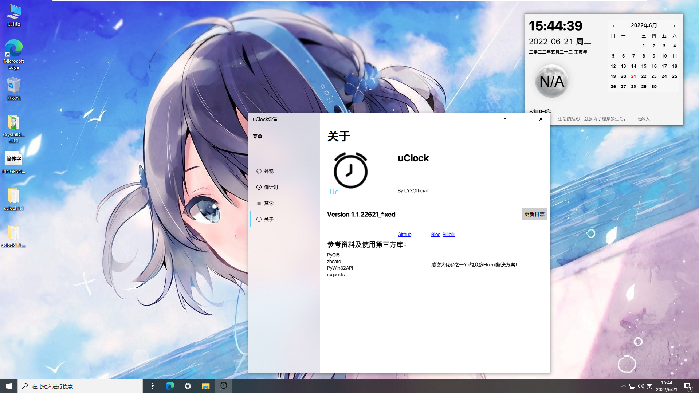
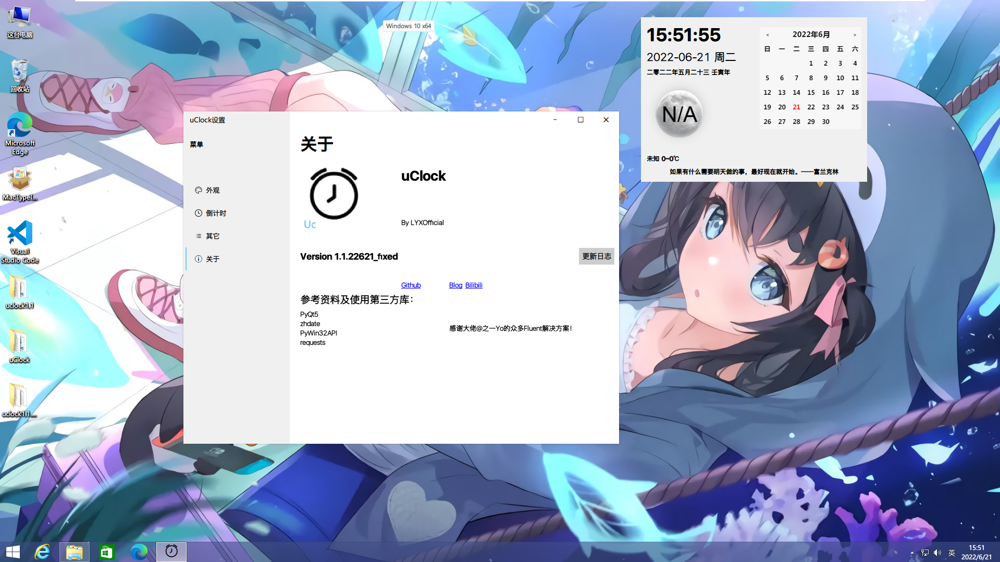
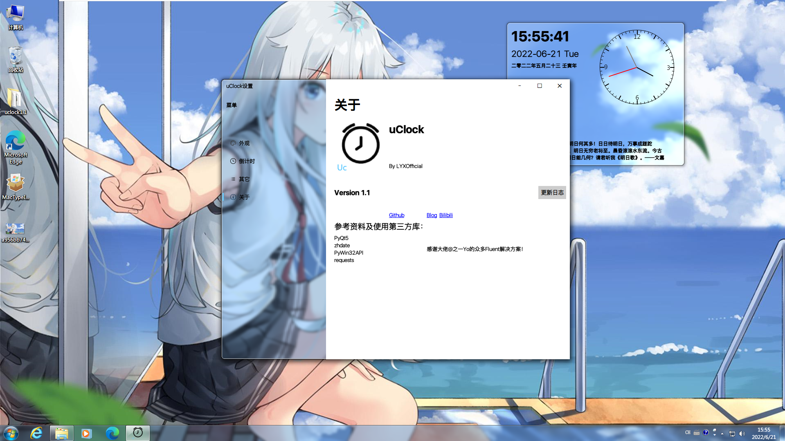

# uClock

<center></center>

## uClock 简洁明了的时钟软件

### 功能介绍

* 基于PyQt5，支持Windows7+系统，暂不支持Linux
* 功能简洁，侧边栏（就是那个显示时钟或日历的地方）支持自定义HTML，支持农历显示、倒计日（比如小中高考用的）、名人名言功能
* 界面美观，契合Fluent Design（说白了都是从大佬那里*~~抄的~~*借鉴的），为Win7、Win10和Win11的Aero、Acrylic和Mica效果做适配，其余系统不支持透明，圆角设计
* 支持自定义背景图
* 后续会添加更多界面美化功能及久坐、喝水、使用时间、最小化啊什么的功能

### 已知bug

1. 很少情况会随机性地莫名其妙的进不去（再开一遍）
2. 开机自启无效（没做）
3. 置顶无效
4. 如果没有勾选“不测试网络”，无网络提醒后每次界面更新会产生重影
5. 设置点得太快会鬼畜（doge）
6. 部分城市无天气
7. release 1.1某些地方会莫名变windows经典风格，过几天发布修正release
8. 设置关了主窗口也关

### 快速开始

如果你是Windows的普通用户，直接下载好Release版本安装就行了

如果你想要尝鲜或硬要源代码，可以这么做：

1. 先下载好Python（3.7+，网上有教程，注意要加环境变量)(废话)
2. 如果你有git，可以直接找一个放uclock的文件夹，右键git bash，然后输入

```bash
   git clone -b main https://github.com/lyxoficial/uclock.git
```

3. 如果想用测试版，可以把上面的main改成dev（暂时没有分），但是可能下下来都运行不了（喜欢写一点传一点）
4. 如果没有，去对应的分支下zip解压下来
5. 这样肯定不能直接运行，所以输入这串神奇的指令

   ```bash
   pip install -i https://pypi.doubanio.com/simple/ PyQt5 pyqtwebengine zhdate pywin32 requests pillow geoip2
   ```

   把依赖库安装下来，就能用Python命令行运行了
   6.运行：cd到程序文件夹，输入：

```bash
pythonw uclock.py
```

### 软件截图

#### Win11（作者电脑截图）

这是1.0正式版的图（0.1、0.3找不到了）


这是1.1测试版的图


这是1.1正式版


亚克力、Aero、无效果、背景图（效果不好）的效果：


#### Win10（LTSC2021虚拟机）截图



#### Win8.1（虚拟机）截图



#### Win7（SP1虚拟机）截图



### 注意事项

1. 如果显示为宋体，请安装PingFang15和PingFang0字体
2. 因为win10(11已修复)的*~~bug~~*特性的原因，开亚克力的话拖动窗口和拉伸窗口会卡顿，可以在外观设置里取消勾选显示窗口内容或者关掉亚克力
3. settings为作者的测试setting配置文件（懒得改了），如果要恢复默认，暂时只能用settingm.json（模板）换掉settings.json（1.2会加恢复默认）
4. Vista和Win7SP0可能无法运行
5. 如果说缺少这个那个的dll啊，这个系统错误，那个exe报错啥的别犹豫，装VC2015可能就好了
6. Linux用户非要跑可以自己尝试改代码
7. 如果出现设置无法保存的问题，可以将主程序（uclock.exe）设置为以管理员身份运行

### ChangeLog

1.0(2022/5/28)
    1. 不用说，创建程序
1.1(2022/6/20)
    1. 设置适配Fluent Design
    2. 适配Win11 Mica
    3. 细节优化（比如圆角）
    4. 修复诸多bug
    5. release可以在大部分Windows7+系统里面运行（作者暂时没有适配Linux，可能会出bug
    6. 天气图标修改
    7 .换用优秀的nuitka打包，更稳定（而且不会像~~*KBY*~~说的那样喝蓝屏钙了），设置字体不会变宋

1.1.22621_fixed(2022/6/21)

1. 因为1.1有很多小问题（release都没还没发github呢），就发布了这个修订版
2. 修复诸多bug，比二十几天的1.1还多（加功能去了）
3. 修复主题问题
4. 彻底不支持Linux（。。。太难适配了)
